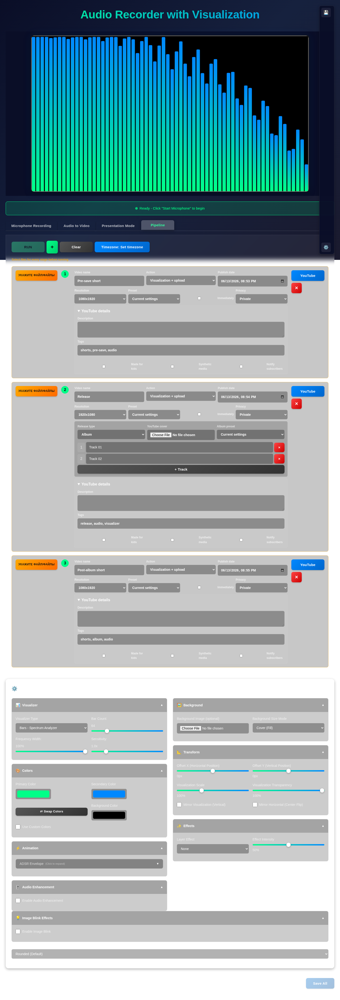
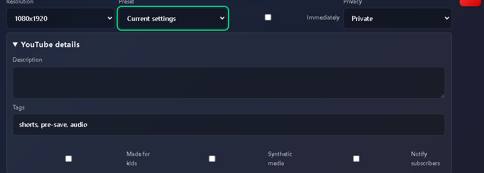
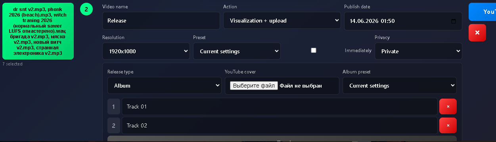
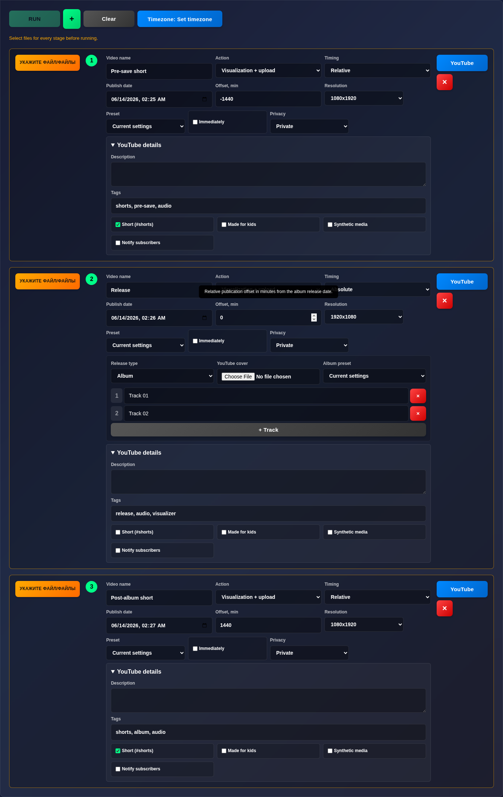

# Issue 127 Case Study: Pipeline Mode for Visualization and YouTube Upload

## Source Data

- Issue: https://github.com/Jhon-Crow/audio-recorder-with-visualization/issues/127
- Pull request draft: https://github.com/Jhon-Crow/audio-recorder-with-visualization/pull/128
- Raw GitHub data is stored in `docs/case-studies/issue-127/logs/`.

## Request Summary

The first request asked to detail a plan, identify missing requirements, and attach a UI sketch for a new "Pipeline" mode placed to the right of Presentation mode. Follow-up feedback requested implementation of the critical Pipeline elements after the planning pass.

The target mode is a batch constructor for preparing a sequence of video jobs:

- Add stages via a central `+` button.
- Each stage has a video name, selected input file(s), action type, optional visualization resolution and preset, publish date, "publish immediately" checkbox, privacy, and YouTube details.
- The execute button stays disabled until every stage has required files.
- The default scenario should help schedule:
  1. pre-save short,
  2. release as album or single,
  3. album track list with editable titles and drag/drop order,
  4. shared album image,
  5. post-album short.

## Current Repository Context

- The example app is a plain HTML/CSS/JS UI in `examples/index.html`, `examples/styles.css`, and `examples/app-core.js`.
- Existing top-level modes are tabs: Microphone Recording, Audio to Video, and Presentation Mode.
- YouTube upload already exists as modal UI in `examples/youtube-upload.js` and uses `src/core/YouTubeUploader.ts`.
- `YouTubeUploader` currently supports title, description, tags, category, privacy, scheduled `status.publishAt`, made-for-kids, synthetic-media, short hashtag, thumbnails, notifications, resumable upload, and progress.
- The app already has localStorage-backed settings and presets, modal patterns, accordions, and simple native drag/drop for preset ordering.
- Cypress coverage exists for tabs, upload modal behavior, preset drag/drop, aspect ratios, and other UI flows.

## External Facts

- YouTube Data API `videos.insert` uploads a video and can set snippet/status metadata. Official docs list a 1,600 unit quota cost for each `videos.insert` call and note that unverified API projects created after July 28, 2020 can have uploaded videos restricted to private viewing.
- YouTube video resource docs say `status.publishAt` schedules publication and can only be set when `privacyStatus` is `private` and the video has never been published. A past `publishAt` behaves like publishing immediately.
- Native `input type="datetime-local"` is the simplest browser control for local publish date/time entry, but it has no timezone in the submitted value. The pipeline must convert user-local values to ISO 8601 timestamps before sending them to YouTube.
- SortableJS is a mature option for drag/drop ordered lists, but the current app already has enough native drag/drop precedent for a first implementation.
- Uppy/FilePond solve richer file picking/upload dashboards, but they would be heavier than needed while files remain local inputs and YouTube upload is handled by the app's own API helper.
- XState can model complex workflows, but a small explicit pipeline state reducer is likely lower risk for this repo's current plain-JS architecture.

References:

- https://developers.google.com/youtube/v3/docs/videos/insert
- https://developers.google.com/youtube/v3/docs/videos
- https://developer.mozilla.org/en-US/docs/Web/HTML/Reference/Elements/input/datetime-local
- https://sortablejs.github.io/Sortable/
- https://uppy.io/docs/dashboard/
- https://pqina.nl/filepond/docs/
- https://stately.ai/docs/xstate

## Proposed UI Shape

Use a numbered list rather than kanban for the first version. A release pipeline is sequential, validation depends on every row, and album scheduling needs deterministic order. Kanban would make sense later only if stages acquire separate statuses such as Draft, Ready, Running, Failed, and Done.

```text
Tabs: Microphone | Audio to Video | Presentation Mode | Pipeline

Pipeline
------------------------------------------------------------------------------
| Default scenario: [Album v]  First publish: [2026-06-13 18:00] [Run]      |
------------------------------------------------------------------------------
| 1  [УКАЖИТЕ ФАЙЛ/ФАЙЛЫ]  Pre-save short                                  |
|    Title [Pre-save short________________] Action [Visualization + upload] |
|    Resolution [1080x1920 v] Preset [Short pulse v]                         |
|    Publish [2026-06-13 18:00] [ ] Immediately Privacy [Private v]          |
|    YouTube details v                                                       |
|    Description [___________________________________________]               |
|    Tags        [shorts, pre-save, artist__________________]               |
|    [ ] Made for kids  [x] Synthetic media  [ ] Notify subscribers          |
------------------------------------------------------------------------------
| 2  [УКАЖИТЕ ФАЙЛ/ФАЙЛЫ]  Release                                          |
|    Release type [Album v]  Shared image [Choose image]                     |
|    Album tracks                                                            |
|    = 1  [Track 01 title________________]                                  |
|    = 2  [Track 02 title________________]                                  |
|    + Track                                                                 |
|    Rule: track 1 uses first publish time, next tracks publish +1 minute.   |
------------------------------------------------------------------------------
| 3  [УКАЖИТЕ ФАЙЛ/ФАЙЛЫ]  Post-album short                                 |
|    Title [Post-album short_______________] Action [Visualization + upload] |
------------------------------------------------------------------------------
```

## Missing Requirements to Clarify

- Should the pipeline execute fully in-browser, only in Electron, or both? Long rendering/upload batches are more reliable in Electron.
- Should users be able to pause/resume a pipeline after closing the app? Browser `File` objects cannot be reliably restored from localStorage, so durable queues require Electron file paths or a server.
- Is the release date/time local to the user's computer timezone, a selected channel timezone, or always YouTube/Pacific-oriented display?
- What are the exact preset semantics: use saved visualizer presets only, or snapshot the current visualizer settings into a stage?
- For album releases, should every track become a separate YouTube video, or should the album also produce one long full-album video?
- Should pre-save/post-album shorts be generated from selected excerpts, whole audio, or separate files?
- Should album art be burned into the visualization background, used as YouTube thumbnail, or both? The existing uploader does not set thumbnails.
- Should failure stop the pipeline, skip to the next stage, or retry with backoff?
- Are YouTube playlists needed for albums?
- Should metadata be copied between stages with templates for title, description, and tags?

## Implementation Plan

1. Add the Pipeline tab skeleton after Presentation Mode in `examples/index.html`.
2. Add scoped styles for compact stage rows, validation states, album track editor, and expanded YouTube details.
3. Add `examples/pipeline.js` to keep pipeline state separate from the large `app-core.js` file.
4. Define serializable pipeline data:
   - `id`, `name`, `files`, `action`, `resolution`, `presetId`, `publishAtLocal`, `publishImmediately`, `privacyStatus`, `youtubeMetadata`, `releaseType`, `tracks`, `sharedImage`.
5. Seed the default scenario with three stage groups: pre-save short, release, and post-album short.
6. Implement add/remove/reorder stage behavior and album track reorder using native drag/drop first.
7. Implement validation:
   - stage files required,
   - title required,
   - visualization stages require resolution and preset,
   - scheduled stages require future date unless `publishImmediately` is checked,
   - album stages require at least one track.
8. Extend `YouTubeUploadMetadata` with optional `publishAt`.
9. Update `buildYouTubeVideoResource` to set `status.publishAt` only for scheduled private videos, and add unit tests for valid schedule/private behavior and invalid non-private schedule behavior.
10. Add pipeline execution service:
    - render visualization stages through `AudioToVideoConverter`,
    - upload direct-video stages through `YouTubeUploader`,
    - compute album track publish times at one-minute intervals,
    - report per-stage progress and errors.
11. Add Cypress tests for tab visibility, default scenario, disabled run button until files exist, conditional visualization selects, album track reorder, and metadata collection.
12. Add a manual verification screenshot to the PR when visual implementation begins.

## Recommended First Slice

Start with a non-executing UI prototype behind the new tab plus persistence and validation. Then add API scheduling support with unit tests. Only after those are stable should the actual sequential runner be wired, because execution combines rendering, OAuth, large file memory pressure, and YouTube quota usage.

## Implemented Critical Slice

The current PR implements the non-executing critical Pipeline UI slice:

- Pipeline tab after Presentation Mode with a default three-stage release scenario: pre-save short, release, and post-album short.
- Right Pipeline sidebar visible only in Pipeline mode, with save/load buttons persisted in `localStorage`.
- Per-stage file picker button before the stage number; RUN stays disabled until every stage has selected files.
- Per-stage video name, action, conditional visualization resolution/preset, publish date, immediate checkbox, privacy, and expanded YouTube details.
- Album release metadata editor with release type, shared YouTube cover input, album preset, editable track list, and drag/drop track ordering.
- Delete button on each stage with a confirmation modal.
- Per-stage YouTube upload modal state key so PR #126's upload-form memory behavior works independently per stage.
- Timezone modal shown on first delayed-publication use and available from Pipeline settings.
- Post-run Reset Fields button with remembered checkbox choices and a 600 ms hold-to-reset confirmation.
- PR #108's batch visualization work is merged from latest upstream `main` so later album execution can reuse the batch conversion path.

Implementation screenshot:



## Implemented Execution Feedback Slice

The latest PR feedback identified four gaps:

- YouTube checkboxes were visually detached from their labels.
- Selected album files did not become album tracks.
- Generated Pipeline controls needed tooltips.
- RUN only reported that the pipeline was ready instead of executing.

This continuation slice addresses those gaps:

- Album file selection now creates ordered editable tracks from selected filenames.
- YouTube details now include explicit Short, Made for kids, Synthetic media, and Notify subscribers controls with adjacent text and tooltips.
- Pipeline stages now support relative or absolute scheduling; default stages are relative except the album release stage, which stays absolute.
- RUN now builds sequential tasks, renders visualization stages through the existing converter, adds rendered videos to the recordings list, and uploads YouTube stages through the existing uploader when the user is signed in.
- Album render/upload tasks are split per selected album file and share the optional album cover as the YouTube thumbnail.
- New Cypress coverage verifies album file-to-track mapping, generated tooltips/checkbox labels, visualization-only execution, and direct YouTube upload metadata.

Feedback screenshots:




Updated Pipeline implementation:


