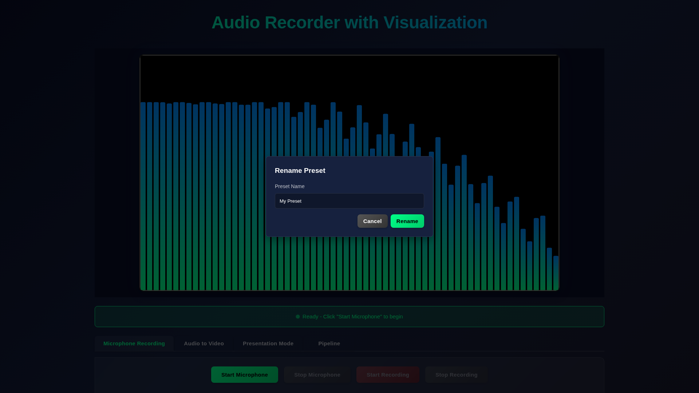
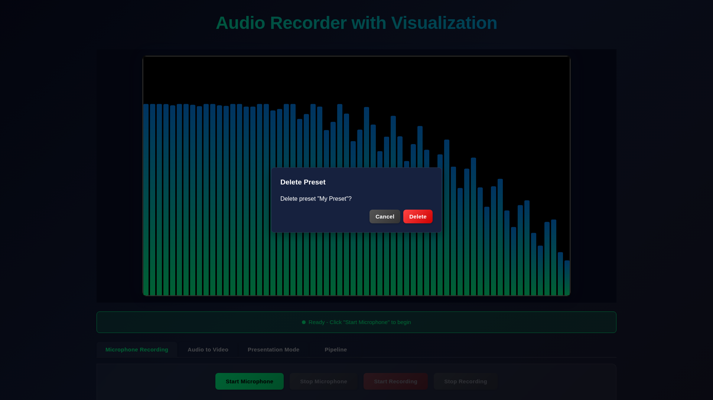

# Case Study: Issue #159 — Fix Text Inputs in Preset Sidebar

**Issue:** https://github.com/Jhon-Crow/audio-recorder-with-visualization/issues/159  
**PR:** https://github.com/konard/Jhon-Crow-audio-recorder-with-visualization/pull/160  
**Branch:** `issue-159-e3c32bd2d4b0`

---

## Problem Statement

Two bugs were reported for preset management in the sidebar:

1. **Rename input unresponsive** — When renaming a preset, the input field opened but typing was often impossible. The user could select text with the mouse but keyboard input did not register.

2. **Delete confirmation unreliable** — Preset deletion used `window.confirm()`, which may silently return `false` in Electron 33 with `contextIsolation: true`, making deletion impossible in the Electron app.

---

## Investigation

### Architecture

The preset sidebar is a CSS-animated `<aside>` (z-index 250) that slides in from the left on hover. The context menu (z-index 550) sits outside the sidebar in the DOM. Modals (z-index 500) are also outside the sidebar.

Key elements:
- `#presetSidebar` — slide-in sidebar, `pointer-events: none` when closed
- `#presetContextMenu` — right-click menu outside sidebar DOM
- `#presetRenameModal` — rename dialog, outside sidebar
- Sidebar open/close controlled by `scheduleClosePresetSidebar()` with 180ms debounce

### Root Cause 1: Focus race condition in rename input

`openPresetRenameDialog()` called `focus()` and `select()` synchronously right after `openModal()`, which only adds the CSS `active` class. Browsers may not have committed the layout change (switching `display: none` → `display: flex`) before `focus()` runs. On some frame timings this caused focus to be silently dropped.

```js
// Before fix — focus called synchronously after display change
openModal(presetRenameModal);
presetRenameInput.focus();   // ← may fire before display:flex is rendered
presetRenameInput.select();
```

**Fix:** Deferred `focus()` and `select()` with `requestAnimationFrame()` to ensure the browser has completed a paint cycle after the modal becomes visible.

### Root Cause 2: Sidebar close timer firing during modal interaction

`scheduleClosePresetSidebar()` fired 180ms after context menu was hidden (which happened when Rename was clicked). The timer only checked `:hover` state and whether the context menu was open — it did not check whether a modal was open. This meant the sidebar would close while the rename modal was active.

While the modal is outside the sidebar (so closing the sidebar doesn't steal focus from the input), the sequence of DOM events could create edge cases where the focus shift coincided with sidebar close and CSS transitions.

**Fix:** Added modal open-state checks to the close guard.

### Root Cause 3: `window.confirm` in Electron

`deletePreset()` used `window.confirm()` for the confirmation dialog. In Electron 33 with `contextIsolation: true`, `window.confirm` is not guaranteed to work and may silently return `false`, making deletion confirmation impossible in the packaged app. Even in the browser, it blocks the JS thread and produces a jarring native OS dialog.

**Fix:** Replaced `window.confirm` with a custom HTML confirmation modal (`#presetDeleteModal`) consistent with the rest of the UI.

### Root Cause 4: Deleted presets reappear after Electron restart

When the user configures a preset folder via the Electron file dialog, presets are saved as individual `.json` files on disk in addition to localStorage. On every restart, `loadPresetsFromFolder` reads all `.json` files from the folder and re-adds any that aren't already in localStorage via `mergePresets`.

`confirmPresetDelete` correctly removed the preset from localStorage and the in-memory array, but **never deleted the `.json` file from disk**. On next startup, `loadPresetsFromFolder` found the file again and re-inserted the preset — making deletion appear to have no lasting effect.

```
Restart sequence exposing the bug:
1. User deletes preset → removed from localStorage, file still on disk
2. App restarts → loadPresetsFromFolder reads all .json files
3. mergePresets() adds back the "deleted" preset (ID not in localStorage)
4. Preset reappears as if deletion never happened
```

**Fix:** After removing from localStorage, call `window.electronAPI.deletePresetFile(preset.sourcePath)` to delete the on-disk `.json` file if one exists. A new `preset-delete-file` IPC handler is added to `electron/main.js` and exposed via `electron/preload.js`. The guard `if (preset.sourcePath && window.electronAPI && window.electronAPI.deletePresetFile)` ensures this is a no-op in browser/non-Electron mode.

### Root Cause 5: Renamed presets revert to original name after Electron restart

The same architectural gap affected rename. `renamePreset()` updated the preset's name in localStorage and re-rendered the sidebar, but **never updated the `.json` file on disk**. On next startup, `loadPresetsFromFolder` read the old file (with the pre-rename name) and `mergePresets` used the file data to overwrite the localStorage entry, silently rolling back the rename.

```
Restart sequence exposing the bug:
1. User renames preset "A" → "B" → localStorage updated, file on disk still has name "A"
2. App restarts → loadPresetsFromFolder reads all .json files (name "A")
3. mergePresets() finds matching ID in localStorage (name "B") and merges — file data wins
4. Preset reverts to "A" as if rename never happened
```

**Fix:** After updating localStorage, call `window.electronAPI.updatePresetFile(preset.sourcePath, updatedPreset)` to write the updated preset JSON back to disk. A new `preset-update-file` IPC handler is added to `electron/main.js` and exposed as `updatePresetFile` in `electron/preload.js`. The rename guard ensures this is a no-op in browser/non-Electron mode.

---

## Changes Made

### `examples/index.html`
- Added `#presetDeleteModal` HTML structure with message paragraph, Cancel, and Delete buttons

### `examples/styles.css`
- Added `.modal-message` style for the delete confirmation text

### `examples/app-core.js`
- Added DOM references: `presetDeleteModal`, `presetDeleteMessage`, `presetCancelDeleteBtn`, `presetConfirmDeleteBtn`
- Added state variable: `let presetDeleteTargetId = null`
- Replaced `deletePreset()` (with `window.confirm`) with `openPresetDeleteDialog()`, `closePresetDeleteDialog()`, and `confirmPresetDelete()`
- Updated `presetDeleteBtn` click handler to call `openPresetDeleteDialog()` instead of `deletePreset()`
- Wired `presetCancelDeleteBtn` and `presetConfirmDeleteBtn` event handlers
- Added `presetDeleteModal` to Escape key handler and backdrop click handler
- Updated `scheduleClosePresetSidebar()` to also check `presetRenameModal`, `presetSaveModal`, and `presetDeleteModal` active state
- Wrapped `presetRenameInput.focus()`/`select()` in `requestAnimationFrame()`
- Wrapped `presetNameInput.focus()`/`select()` in `requestAnimationFrame()`
- Made `confirmPresetDelete` async; added call to `electronAPI.deletePresetFile(preset.sourcePath)` after localStorage removal

### `electron/main.js`
- Added `preset-delete-file` IPC handler that deletes the preset `.json` file from disk
- Added `preset-update-file` IPC handler that overwrites a preset `.json` file with updated content

### `electron/preload.js`
- Exposed `deletePresetFile(filePath)` on `window.electronAPI`
- Exposed `updatePresetFile(filePath, preset)` on `window.electronAPI`

### `cypress/e2e/preset-management.cy.js`
- Updated existing rename/delete/reorder test: replaced `cy.stub(win, 'confirm')` with the new custom modal flow
- Added test: `rename input receives focus and accepts typing after context menu click`
- Added test: `delete confirmation uses a custom modal instead of window.confirm`
- Added test: `persists rename to disk via updatePresetFile when sourcePath is present`

---

## Before / After Screenshots

| Rename Modal (after fix) | Delete Modal (after fix) |
|---|---|
|  |  |

---

## Test Results

All 10 Cypress tests pass after the fix, including 3 new tests that verify the specific bugs.

```
✔  preset-management.cy.js   10 passing
```
