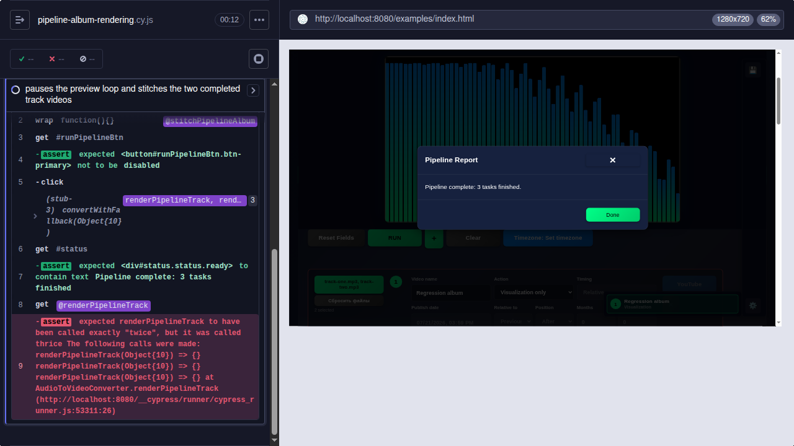
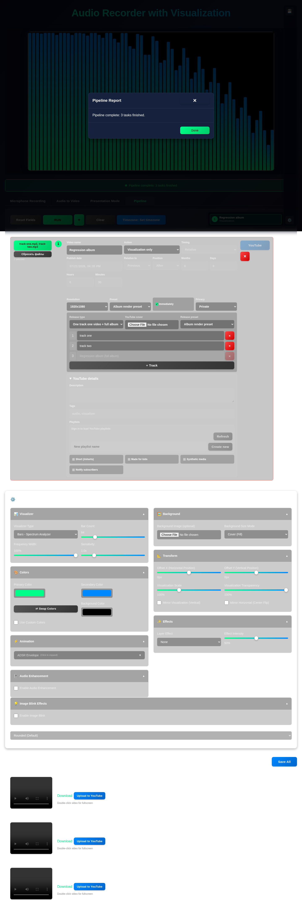

# Issue 199 case study: stable track renders and a valid full-album video

## Scope

- Issue: https://github.com/Jhon-Crow/audio-recorder-with-visualization/issues/199
- Pull request: https://github.com/Jhon-Crow/audio-recorder-with-visualization/pull/200
- Earlier feature issue: https://github.com/Jhon-Crow/audio-recorder-with-visualization/issues/179
- Earlier implementation PR: https://github.com/Jhon-Crow/audio-recorder-with-visualization/pull/180

Issue 199 reports two related failures in the `One track one video + full album` pipeline mode:

1. Individual track visualizations flicker or glitch, especially near the start.
2. The full-album visualization freezes or disappears instead of reusing and correctly joining the completed per-track videos.

This folder preserves the source reports, historical discussion, screenshots, failing reproductions, verification logs, and external technical research used to diagnose and fix those failures.

## Executive finding

The failures did not come from a single visualizer. They came from four pipeline/media integration defects:

- The live `AudioRecorder` preview animation and `AudioToVideoConverter` export animation could write to the same canvas concurrently.
- The inline full-album task was marked with `isFullAlbum`, while the renderer only recognized `fullAlbumVideo`; it therefore rendered the first audio track a third time.
- The derived full-album path did reuse cached videos, but built its output with `new Blob(renderedParts)`. That concatenates bytes, not WebM/MP4 container timelines, tracks, headers, indexes, or timestamps.
- Pipeline progress expected an object shaped like `{ percent }`, although the converter's public callback sends a number from `0` to `1`.

The implemented path now pauses the preview canvas writer, renders each audio track exactly once, decodes the completed videos in order, composites their frames to one continuous canvas stream, routes their audio through one stable Web Audio destination, and records a fresh valid container with the project's existing `VideoRecorder`. Direct-upload album videos use the same joiner. The preview resumes after success or failure.

## Before and after

Before the fix, the two-track regression stopped on the third conversion call because the first track was rendered again instead of invoking the album joiner:



After the fix, Playwright exercised the same two-track release in a real browser. The report shows three completed tasks, the progress bar is at 100%, the preview has resumed, and the recording list contains both individual tracks plus `Regression album (full album).webm`:



## Reconstructed timeline

- **2026-06-25 13:37 UTC** — Issue 179 requested a `Full album in one video` option.
- **2026-06-25 13:38 UTC** — PR 180 opened with the first full-album implementation.
- **2026-06-25 17:41 UTC** — The repository owner clarified that full album must be a join/preparation stage based on videos already rendered by the album stage, not a second visualization pass. The same comment reported progress stuck at `0%`; `pr-180-progress-regression.png` preserves that report.
- **2026-06-25 17:58 UTC** — Commit `db5062c` cached source track results and replaced the second visualization pass with `new Blob(renderedParts)`. The change removed duplicate rendering for the separate derived-stage variant, but did not create a valid media container.
- **2026-06-26 08:42 UTC** — PR 180 merged.
- **2026-07-21 15:33 UTC** — Issue 199 reported flickering individual tracks and frozen/disappearing full-album output in `One track one video + full album` mode.
- **2026-07-21 16:00 UTC** — Commit `68baeca` added a minimal Cypress reproduction. With two selected tracks, the current pipeline called `convertWithFallback` three times. The failure is preserved in `logs/cypress-reproduction.log` and `before-pipeline-album-rendering.png`.
- **2026-07-21** — A second focused unit reproduction showed that an explicitly stopped visualization restarted when page visibility changed, allowing the competing canvas writer to return during a long render. See `logs/unit-visibility-reproduction.log`.
- **2026-07-21** — The browser-level media check generated two real WebM segments, joined them through the new implementation, and successfully decoded the output at its requested dimensions. See `logs/cypress-real-stitch-draft.log`.
- **2026-07-21 16:34 UTC** — Playwright ran the repaired two-track pipeline in Chromium and captured three completed tasks, 100% progress, a resumed preview, and three output recordings in `after-pipeline-album-rendering.png`.
- **2026-07-21 16:44 UTC** — Commit `66a526f` completed the media-aware joiner, pipeline routing/progress fixes, preview ownership coordination, and regression coverage.

## Reproduction and evidence

### Inline album mode renders the first track again

The failing Cypress setup selects two audio files in an `album-with-full` visualization-only release. It stubs the track converter and the intended video joiner, then runs the pipeline.

Expected:

- two converter calls, one per audio file;
- one joiner call receiving the two completed video blobs;
- three finished tasks in total;
- the preview loop stopped once and resumed once.

Before the fix:

- the converter was called three times;
- the third call used the first track again;
- the joiner was never called;
- the preview loop was never paused.

The exact Cypress failure is: `expected renderPipelineTrack to have been called exactly "twice", but it was called thrice`.

### The previous “join” is binary concatenation

The earlier implementation collected valid rendered blobs and then ran the equivalent of:

```js
new Blob([trackOneWebM, trackTwoWebM], { type: 'video/webm' })
```

This only places the byte sequences next to one another. Each input still contains its own container header, track declarations, clusters/fragments, timestamps, cues/indexes, and end state. A player may stop after the first logical file, reject later structures, show a frozen last frame, or expose no frames at all.

The focused real-media regression avoids checking only MIME type or blob size. It asks the browser to load the joined output and verifies its decoded video dimensions, proving that the output is a playable container.

### Two animation loops share one canvas

The normal single/batch conversion UI already stopped `AudioRecorder` visualization before calling the converter. Pipeline mode omitted that coordination. Both loops therefore called drawing methods on `AudioRecorderApp.canvas`:

- `AudioRecorder` continuously drew the live preview using `requestAnimationFrame` (or a timer while hidden).
- `AudioToVideoConverter` drew export frames using its own `requestAnimationFrame` loop.

Whichever callback ran last supplied the frame captured by `canvas.captureStream()`. That race explains transient bars from the preview, incorrect early frames, and apparent flicker. Page visibility changes made it worse because the recorder's visibility handler could restart a loop that had been explicitly stopped.

### Progress contract mismatch

`ConversionConfig.onProgress` is typed as `(progress: number) => void`, and `AudioToVideoConverter` reports values such as `0.5` and `1`. Pipeline mode read `progress?.percent`; a number has no `percent` member, so every intermediate value became zero. Historical Cypress stubs passed `{ percent }` and accidentally concealed this mismatch.

## Implemented solution

### Pipeline task routing

- Treat both `isFullAlbum` (inline release task) and `fullAlbumVideo` (derived stage task) as combined-album tasks.
- Cache each normal track render by source stage and track index.
- For visualization stages, supply the cached completed blobs to the joiner in track order.
- For direct-upload stages, accept selected video files as the already-completed source videos and join them before the full-album upload.
- Fail clearly if only some expected track renders exist or if an audio-only upload stage has no completed videos to join.
- Preserve edited album track titles for per-track direct uploads.

### Browser-native media-aware joiner

`AudioToVideoConverter.concatenateVideosWithFallback()` uses the project's existing browser media stack:

1. Create blob URLs and preload each completed video.
2. Connect every media element to one `MediaStreamAudioDestinationNode`. Only the current element plays, while the destination provides one stable audio track for the whole output.
3. Start one `VideoRecorder` on the output canvas and stable audio destination.
4. Play sources sequentially and draw decoded video frames to the canvas. Use `requestVideoFrameCallback` where available, with `requestAnimationFrame` as the compatibility fallback.
5. Stop the recorder only after the final source ends, producing one set of container headers and one continuous output timeline.
6. Revoke object URLs, disconnect audio nodes, stop destination tracks, close the audio context, and stop/cancel the recorder on every exit path.
7. Reuse the existing MP4 encoder probe and WebM fallback behavior.

This is a re-encode of finished videos, not a second visualization render. It favors correctness and zero new runtime dependencies. The cost is real-time joining and one additional encode generation.

### Canvas ownership

- Pipeline mode records whether the main preview loop is active.
- It stops that loop before any task that writes the canvas.
- `AudioRecorder` now remembers an explicit suspension, so tab visibility changes cannot restart the preview during export.
- The prior preview resumes in the pipeline `finally` path when an audio source still exists.

### Progress

- Pipeline mode now accepts the documented numeric callback while retaining compatibility with `{ percent }` producers.
- Track render and full-album join progress feed both the status text and the global pipeline progress bar.
- Join progress is duration-weighted when all source durations are known and otherwise advances per source; reported values never move backward.

## Alternatives considered

### FFmpeg / ffmpeg.wasm concat demuxer

FFmpeg's concat demuxer is the conventional no-re-encode option when every input has compatible streams, codecs, time bases, and parameters. In a desktop/server build it could join identical per-track renders quickly with `-c copy`. `ffmpeg.wasm` makes FFmpeg available in a browser worker.

Why it was not selected for this patch:

- the project currently has no FFmpeg runtime or WASM delivery path;
- the WASM payload and memory duplication are material for long album videos;
- portable Electron packaging and browser hosting would need new worker/assets/CSP handling;
- incompatible or encoder-fallback track parameters would still require a transcode path.

It remains a strong future optimization for a packaged desktop build, especially if track exports are guaranteed identical.

### Mediabunny demux/remux

Mediabunny supplies browser-side media input, output, conversion, and container writers. It could provide a higher-level remux/transcode implementation without shipping all of FFmpeg. Correct concatenation would still require timestamp rebasing, compatible track configuration, and explicit handling of formats/codecs its runtime can decode and encode.

This is the most promising library alternative if real-time re-recording becomes too slow or generation loss is unacceptable.

### WebCodecs plus a muxer

WebCodecs exposes decoded frames and encoded chunks with precise control and could join faster than real-time on supported hardware. WebCodecs intentionally does not provide media container demuxing/muxing, so the project would also need a container library and more compatibility/fallback code. It is a larger architectural change than this issue requires.

### Server-side FFmpeg

A service can upload inputs, join them reliably, and return one album video. That changes the application's local-first architecture, adds transfer time and operating cost, and sends user media off-device. It was rejected for the current browser/Electron scope.

## External technical references

- MDN, `Blob()` constructor: the constructor creates a blob from an array of supplied data, which explains why `new Blob(parts)` is byte aggregation rather than media muxing: https://developer.mozilla.org/en-US/docs/Web/API/Blob/Blob
- FFmpeg formats documentation, concat demuxer: https://ffmpeg.org/ffmpeg-formats.html#concat
- FFmpeg FAQ, joining video files and the limited cases where file-level concatenation works: https://ffmpeg.org/faq.html#How-can-I-join-video-files_003f
- MDN, `HTMLCanvasElement.captureStream()`: https://developer.mozilla.org/en-US/docs/Web/API/HTMLCanvasElement/captureStream
- MDN, `HTMLVideoElement.requestVideoFrameCallback()`: https://developer.mozilla.org/en-US/docs/Web/API/HTMLVideoElement/requestVideoFrameCallback
- MDN, `AudioContext.createMediaStreamDestination()`: https://developer.mozilla.org/en-US/docs/Web/API/AudioContext/createMediaStreamDestination
- MDN, `MediaRecorder`: https://developer.mozilla.org/en-US/docs/Web/API/MediaRecorder
- W3C WebCodecs specification, including its explicit non-goal of media container demuxing: https://www.w3.org/TR/webcodecs/
- ffmpeg.wasm overview: https://ffmpegwasm.netlify.app/docs/overview/
- Mediabunny media conversion guide: https://mediabunny.dev/guide/converting-media-files
- Mediabunny output/writer guide: https://mediabunny.dev/guide/writing-media-files
- Mediabunny output-format support: https://mediabunny.dev/guide/output-formats
- WebM container guidelines: https://www.webmproject.org/docs/container/

## Regression coverage

- `cypress/e2e/pipeline-album-rendering.cy.js`
  - reproduces the inline `album-with-full` routing failure;
  - proves two audio tracks render exactly once each;
  - proves the two completed blobs are passed to one join operation;
  - proves preview suspension/resumption;
  - creates and joins two real browser-recorded WebM sources, then decodes the result.
- `cypress/e2e/pipeline-mode.cy.js`
  - proves direct-upload `album-with-full` stages join the selected videos before the third upload;
  - proves derived full-album stages reuse the two cached track renders and invoke one joiner;
  - uses the converter's real numeric progress contract.
- `tests/AudioToVideoConverter.test.ts`
  - covers empty inputs, normal WebM results, and MP4-to-WebM fallback.
- `tests/AudioRecorder.test.ts`
  - proves explicit preview suspension survives hidden/visible document transitions until resumed.

## Verification

- Failing pipeline reproduction: `logs/cypress-reproduction.log` — 0 passing / 1 failing before the production fix, with three converter calls for two tracks.
- Failing visibility reproduction: `logs/unit-visibility-reproduction.log` — explicit stop incorrectly became active after `visibilitychange` before the recorder fix.
- Final unit suite: `logs/unit-tests-final.log` — 10 suites and 354 tests passing.
- Final typecheck, lint, and build: `logs/typecheck-final.log`, `logs/lint-final.log`, and `logs/build-final.log` — passed; the build retained the repository's existing Rollup warnings.
- Final real-container browser check: `logs/cypress-real-stitch-final.log` — 2 passing. The test plays the joined output and samples frames, confirming that both differently colored source segments occur in sequence.
- Focused pipeline suite: `logs/cypress-pipeline-final.log` — 36 passing. The only two failures are unchanged navigator/date assertions at `pipeline-mode.cy.js:271` and `pipeline-mode.cy.js:438`; all album routing, joining, upload, progress, and title assertions pass.
- Complete browser suite: `logs/cypress-all-final.log` — 93 of 102 passing. All album tests pass. The nine failures are outside the changed album path: one intermittent selected-file reload assertion that passed in the focused run, the same two navigator/date assertions, and six YouTube UI timing/sidebar-actionability failures in an unmodified spec.
- Playwright: `after-pipeline-album-rendering.png` and `logs/playwright-final.log` — three tasks completed, progress reached 100%, preview state returned to `resumed`, and the recording list contained both tracks and the full album. The only browser-console request failure was the example's absent `favicon.ico`.

## Preserved data

- `issue.json`, `issue-comments.json`: issue 199 metadata and all issue comments.
- `pr.json`, `pr-conversation-comments.json`, `pr-review-comments.json`, `pr-reviews.json`: PR 200 metadata and all three GitHub feedback channels.
- `related-issue-179.json`, `related-pr-180.json`, `related-pr-180-conversation-comments.json`: the prior feature request and implementation history.
- `pr-180-*.png`: all six user-attachment screenshots found in the related PR discussion. Each download was authenticated and its PNG signature (`89 50 4e 47 0d 0a 1a 0a`) was verified because the environment did not provide the `file` command.
- `before-pipeline-album-rendering.png`: Cypress before-state showing three converter calls in a two-track album run.
- `after-pipeline-album-rendering.png`: Playwright after-state showing three completed tasks and all three recordings.
- `logs/npm-ci.log`: reproducible dependency installation/build output.
- `logs/cypress-reproduction.log`, `logs/unit-visibility-reproduction.log`: failing tests captured before their fixes.
- `logs/`: focused and final local reproduction and verification logs.
